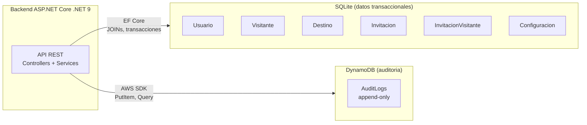
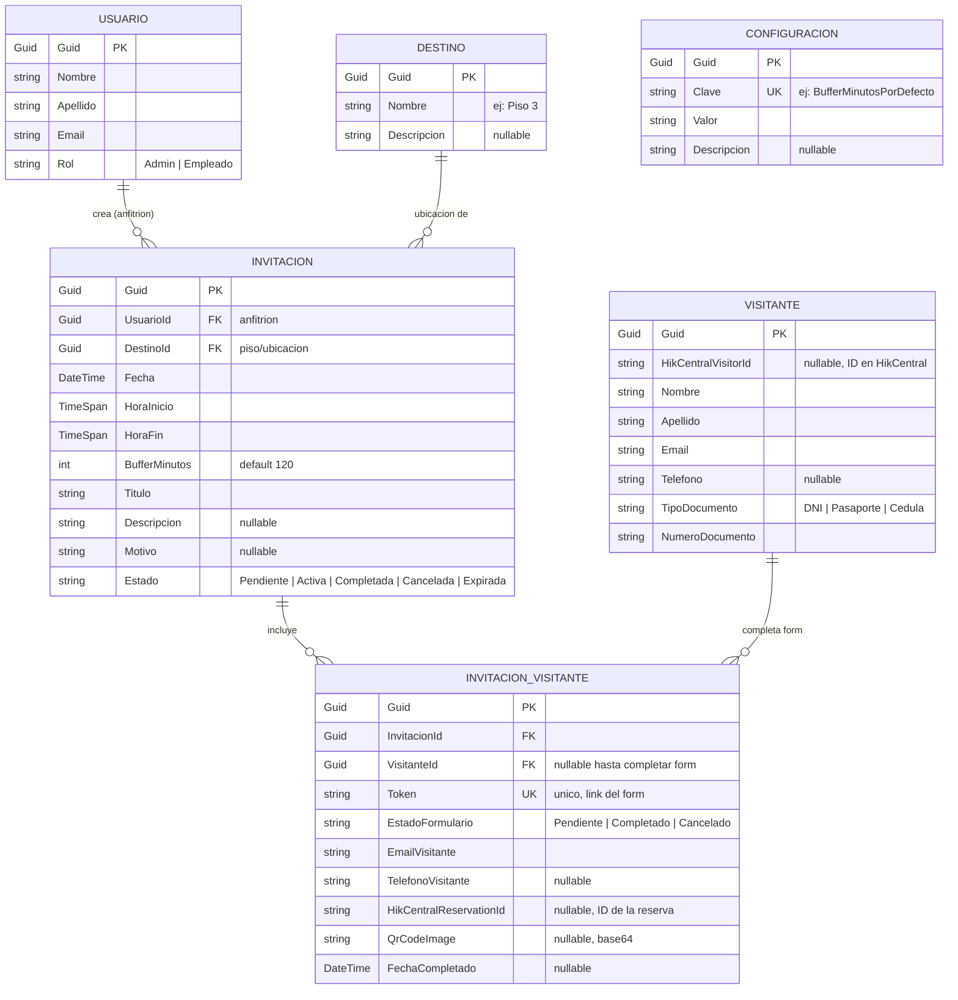

# Modelo de Datos

Documentacion del modelo de datos del sistema de invitaciones para visitantes.
Cubre el diagrama entidad-relacion, la arquitectura de persistencia (polyglot)
y la descripcion detallada de cada tabla.

## Indice

1. [Arquitectura de persistencia](#1-arquitectura-de-persistencia)
2. [Diagrama Entidad-Relacion](#2-diagrama-entidad-relacion)
3. [Descripcion de las tablas](#3-descripcion-de-las-tablas)
4. [Relaciones](#4-relaciones)
5. [Notas tecnicas](#5-notas-tecnicas)

---

## 1. Arquitectura de persistencia

El sistema usa **polyglot persistence**: cada tipo de dato vive en el
almacenamiento que mejor lo soporta.



| Almacenamiento | Tablas | Por que |
|---|---|---|
| **SQLite** | `Usuario`, `Visitante`, `Destino`, `Invitacion`, `InvitacionVisitante`, `Configuracion` | Modelo relacional con joins frecuentes, queries arbitrarias y necesidad de transacciones ACID |
| **DynamoDB** | `AuditLogs` | Patron append-only de alto volumen, sin relaciones, queries simples por tipo de evento + rango de fechas |

> **Camino a produccion a escala:** SQLite es adecuado para una sola instancia
> del backend. Para multiples instancias o alta concurrencia, migrar a Amazon
> RDS (PostgreSQL o SQL Server) cambiando `UseSqlite` por `UseNpgsql` o
> `UseSqlServer` en `Backend/Infraestructura/Extensiones/DependencyInjection.cs`.
> Ver `SSO-Finnegans-Deployment.md` seccion 4.5 para detalles.

---

## 2. Diagrama Entidad-Relacion

Diagrama de las tablas relacionales (SQLite). La tabla `AuditLogs` de DynamoDB
se documenta aparte en la seccion 3.7.



---

## 3. Descripcion de las tablas

### 3.1 Usuario

Personas que acceden al sistema (empleados que crean invitaciones, admins que
ven reportes). Se autentican via SSO de Finnegans GO.

| Columna | Tipo | Nullable | Descripcion |
|---|---|---|---|
| `Guid` | `Guid` | No | **PK**. Generado al crear el objeto en C#. |
| `Nombre` | `string` | No | Nombre del usuario. |
| `Apellido` | `string` | No | Apellido del usuario. |
| `Email` | `string` | No | Email corporativo. Usado para matching con Finnegans. |
| `Rol` | `string` | No | `"Admin"` o `"Empleado"`. Los admins ven todas las invitaciones; los empleados solo las propias. |

**Notas:**
- No tiene `Password` porque la autenticacion es 100% delegada a Finnegans.
- Se crea automaticamente al primer login SSO si `Finnegans__AutoCreateUsuarios=true`.

---

### 3.2 Visitante

Persona externa que visita el edificio. Se crea/actualiza cuando completa el
formulario de registro accediendo via link unico.

| Columna | Tipo | Nullable | Descripcion |
|---|---|---|---|
| `Guid` | `Guid` | No | **PK**. |
| `HikCentralVisitorId` | `string` | Si | ID del visitante en el sistema HikCentral (control de acceso). Se completa al crear la primera reserva. |
| `Nombre` | `string` | No | Nombre del visitante. |
| `Apellido` | `string` | No | Apellido del visitante. |
| `Email` | `string` | No | Email del visitante. Usado para identificar visitantes recurrentes. |
| `Telefono` | `string` | Si | Telefono de contacto. |
| `TipoDocumento` | `string` | No | `"DNI"`, `"Pasaporte"` o `"Cedula"`. |
| `NumeroDocumento` | `string` | No | Numero del documento. Requerido por HikCentral. |

**Notas:**
- Un mismo visitante (mismo email) puede tener multiples `InvitacionVisitante`.
- Sus datos se actualizan en cada registro (el ultimo gana).

---

### 3.3 Destino

Piso o ubicacion dentro del edificio (planta baja, piso 2, sala de reuniones,
etc.). Es informativo: NO se envia a HikCentral.

| Columna | Tipo | Nullable | Descripcion |
|---|---|---|---|
| `Guid` | `Guid` | No | **PK**. |
| `Nombre` | `string` | No | Ej: `"Piso 3"`, `"Recepcion"`. |
| `Descripcion` | `string` | Si | Descripcion ampliada, ej: `"Oficinas administrativas"`. |

**Notas:**
- Pre-cargado por `SeedData` con destinos por defecto.
- El admin puede agregar/editar destinos desde la UI.

---

### 3.4 Invitacion

Invitacion creada por un empleado para uno o mas visitantes en una fecha y
horario especifico.

| Columna | Tipo | Nullable | Descripcion |
|---|---|---|---|
| `Guid` | `Guid` | No | **PK**. |
| `UsuarioId` | `Guid` | No | **FK** a `Usuario`. Es el anfitrion. |
| `DestinoId` | `Guid` | No | **FK** a `Destino`. Donde sera la visita. |
| `Fecha` | `DateTime` | No | Dia de la visita (solo se usa la parte de fecha). |
| `HoraInicio` | `TimeSpan` | No | Horario de inicio (ej: `09:00:00`). |
| `HoraFin` | `TimeSpan` | No | Horario de fin (ej: `17:00:00`). |
| `BufferMinutos` | `int` | No | Margen agregado antes/despues del horario para la reserva en HikCentral. Default `120`. |
| `Titulo` | `string` | No | Titulo descriptivo de la visita. |
| `Descripcion` | `string` | Si | Detalle adicional. |
| `Motivo` | `string` | Si | Motivo de la visita (campo `visitPurpose` en HikCentral). |
| `Estado` | `string` | No | `"Pendiente"` (nadie completo el form), `"Activa"` (al menos uno completo), `"Completada"` (todos completaron), `"Cancelada"` (cancelada por admin/anfitrion), `"Expirada"` (paso la fecha sin completar). |

---

### 3.5 InvitacionVisitante

Tabla intermedia que asocia una `Invitacion` con cada `Visitante` invitado.
Cada registro tiene su propio `Token` (URL del formulario) y su propio
`EstadoFormulario`.

| Columna | Tipo | Nullable | Descripcion |
|---|---|---|---|
| `Guid` | `Guid` | No | **PK**. |
| `InvitacionId` | `Guid` | No | **FK** a `Invitacion`. |
| `VisitanteId` | `Guid` | **Si** | **FK** a `Visitante`. `null` hasta que el visitante completa el formulario; ahi se asocia (o se crea) el `Visitante`. |
| `Token` | `string` | No | **Indice unico**. UUID que se usa como parametro de URL publica: `/registro/{Token}`. Se genera al crear el registro. |
| `EstadoFormulario` | `string` | No | `"Pendiente"`, `"Completado"`, `"Cancelado"`. |
| `EmailVisitante` | `string` | No | Email al que se manda el link. Se conoce al crear la invitacion (antes de saber quien es el visitante). |
| `TelefonoVisitante` | `string` | Si | Telefono opcional capturado al crear la invitacion. |
| `HikCentralReservationId` | `string` | Si | ID de la reserva creada en HikCentral. Se completa cuando se confirma el registro. |
| `QrCodeImage` | `string` | Si | Imagen base64 del codigo QR de acceso (devuelto por HikCentral). |
| `FechaCompletado` | `DateTime` | Si | Timestamp del momento en que el visitante completo el formulario. |

**Notas:**
- Es la entidad mas compleja: combina datos pre-invitacion (`EmailVisitante`,
  `Token`) con datos post-registro (`VisitanteId`, `HikCentralReservationId`,
  `QrCodeImage`, `FechaCompletado`).
- El `Token` es la unica forma de acceder al formulario sin autenticacion.
  Por eso es UUID y tiene indice unico.

---

### 3.6 Configuracion

Almacen clave-valor para parametros globales del sistema. Permite cambiar
configuracion sin redeploy.

| Columna | Tipo | Nullable | Descripcion |
|---|---|---|---|
| `Guid` | `Guid` | No | **PK** (requerimiento de EF Core). |
| `Clave` | `string` | No | **Indice unico**. PK logico. Ej: `"BufferMinutosPorDefecto"`. |
| `Valor` | `string` | No | Valor serializado (string, numero, JSON, etc.). |
| `Descripcion` | `string` | Si | Documentacion humana de para que sirve. |

**Notas:**
- Aunque tiene `Guid` como PK fisica, la `Clave` es la PK logica (es como se
  consulta siempre).
- Pensado para configuracion que el admin puede cambiar (ej: buffer por
  defecto, dias maximos de anticipacion), no para feature flags de codigo.

---

### 3.7 AuditLog (DynamoDB)

Registro inmutable de eventos del sistema. **No vive en SQLite** sino en
DynamoDB (tabla `AuditLogs`).

| Columna | Tipo | Descripcion |
|---|---|---|
| `Guid` | `string` | **Hash key**. UUID del evento. |
| `EventType` | `string` | Tipo de evento. Ej: `"INVITATION_CREATED"`, `"FORM_COMPLETED"`, `"RESERVATION_CREATED"`, `"VISITOR_CANCELLED"`. Indexado en GSI `EventType-Timestamp-index`. |
| `Timestamp` | `number` | Unix epoch en segundos. Range key del GSI. |
| `UsuarioId` | `string` (Guid) | Usuario que origino el evento. Opcional. |
| `UsuarioEmail` | `string` | Email denormalizado del usuario (para consultas sin join). Opcional. |
| `VisitanteId` | `string` (Guid) | Visitante involucrado. Opcional. |
| `VisitanteEmail` | `string` | Email denormalizado del visitante. Opcional. |
| `InvitacionId` | `string` (Guid) | Invitacion relacionada. Opcional. |
| `InvitacionTitulo` | `string` | Titulo denormalizado de la invitacion. Opcional. |
| `Metadata` | `string` | JSON serializado con datos especificos del evento. Opcional. |

**Notas:**
- Modelo append-only: nunca se modifica ni se borra un registro.
- Denormalizado a proposito: guarda `Email` y `Titulo` ademas de los IDs para
  que las consultas no requieran joins (DynamoDB no soporta joins).
- GSI `EventType-Timestamp-index` permite queries como "todos los
  `INVITATION_CREATED` del ultimo mes" en O(log n).
- En desarrollo se puede usar el mock (`MockAuditLogService`) seteando
  `AuditLog__UseMock=true`.

---

## 4. Relaciones

| Relacion | Cardinalidad | Significado |
|---|---|---|
| `Usuario` ? `Invitacion` | 1:N | Un empleado/admin crea multiples invitaciones (es el anfitrion). |
| `Destino` ? `Invitacion` | 1:N | Un piso/ubicacion es destino de multiples invitaciones a lo largo del tiempo. |
| `Invitacion` ? `InvitacionVisitante` | 1:N | Una invitacion puede incluir varios visitantes (se manda un mail/link a cada uno). |
| `Visitante` ? `InvitacionVisitante` | 1:N (opcional) | Un visitante puede tener multiples invitaciones a lo largo del tiempo. La FK es **nullable** porque al crear la invitacion todavia no sabemos quien es el visitante (se conoce cuando completa el formulario). |

Todas las relaciones estan configuradas explicitamente en
`Backend/Infraestructura/Database/ApplicationDbContext.cs` dentro de
`OnModelCreating`.

---

## 5. Notas tecnicas

### 5.1 Generacion de PKs

Todas las primary keys son `Guid` (no `int auto-increment`). Ventajas:

- Se pueden generar en C# sin consultar la DB (`Guid.NewGuid()` en el
  constructor de cada entidad).
- Permite crear entidades con sus relaciones en memoria antes de hacer
  `SaveChanges` (necesario en `InvitacionesService.CrearInvitacion`).
- Evita problemas si en el futuro se sincronizan datos entre instancias.

### 5.2 Indices unicos

Configurados en `ApplicationDbContext.OnModelCreating`:

- `InvitacionVisitante.Token` ? unique. Es la URL publica del form.
- `Configuracion.Clave` ? unique. Es el PK logico.

### 5.3 Foreign keys "logicas" (no enforced en DB)

Algunos campos referencian IDs externos pero **no son FK** en nuestra DB:

- `Visitante.HikCentralVisitorId` ? referencia un visitante en HikCentral.
- `InvitacionVisitante.HikCentralReservationId` ? referencia una reserva en
  HikCentral.
- `AuditLog.UsuarioId`, `AuditLog.VisitanteId`, `AuditLog.InvitacionId` ?
  referencian registros de SQLite pero viven en DynamoDB.

Estas referencias son **eventually consistent**: pueden quedar "huerfanas" si
se borra el registro referenciado. Es un trade-off aceptado para mantener
desacopladas las bases de datos.

### 5.4 Creacion del schema

EF Core ejecuta `Database.EnsureCreated()` al arrancar el backend
(`Program.cs`), que:

1. Si el archivo `grupo6.db` no existe ? lo crea y genera todas las tablas
   a partir del modelo C#.
2. Si ya existe ? no hace nada.

**Limitacion:** `EnsureCreated` NO soporta migracion incremental de schema.
Si se modifican entidades en una nueva version, hay que borrar el archivo
SQLite para que se recree. En produccion, si se necesitan cambios sin perder
datos, migrar a `dotnet ef migrations` + `Database.Migrate()`.

### 5.5 Tabla AuditLogs en DynamoDB

La tabla se crea automaticamente al arrancar el backend (si
`AuditLog__UseMock=false`) en `Backend/Infraestructura/Servicios/DynamoDbInitializer.cs`.
Definicion:

```text
TableName: AuditLogs
  HashKey: Guid (string)

GlobalSecondaryIndex: EventType-Timestamp-index
  HashKey: EventType (string)
  RangeKey: Timestamp (number)
  Projection: ALL
```

Esto permite tanto `GetItem` por `Guid` como `Query` por `EventType` con
ordenamiento por `Timestamp`.
